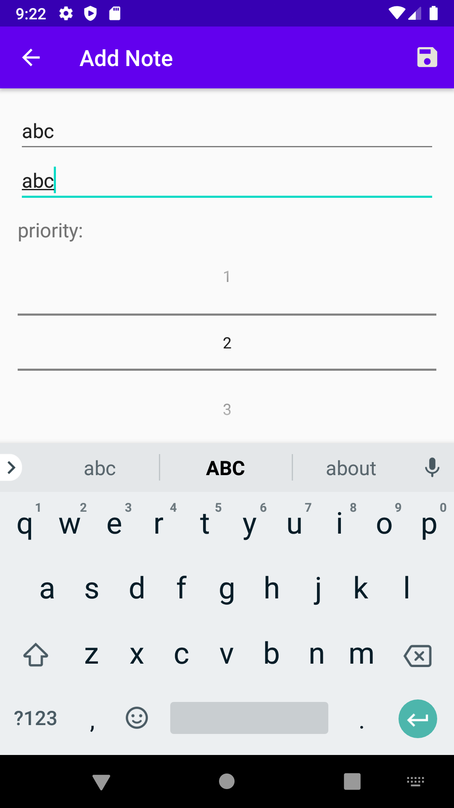

### Recycle View

### Adding Note

### Editing Note

# MVVM Architecture Principles
Model-View-ViewModel (MVVM) is a software design pattern that is structured to separate program logic and user interface controls.

The separation of the code in MVVM is divided into View, ViewModel and Model:
- View is the collection of visible elements, which also receives user input. This includes user interfaces (UI), animations and text. The content of View is not interacted with directly to change what is presented.
- ViewModel is located between the View and Model layers. This is where the controls for interacting with View are housed, while binding is used to connect the UI elements in View to the controls in ViewModel.
- Model houses the logic for the program, which is retrieved by the ViewModel upon its own receipt of input from the user through View.

# MVVM Architecture

